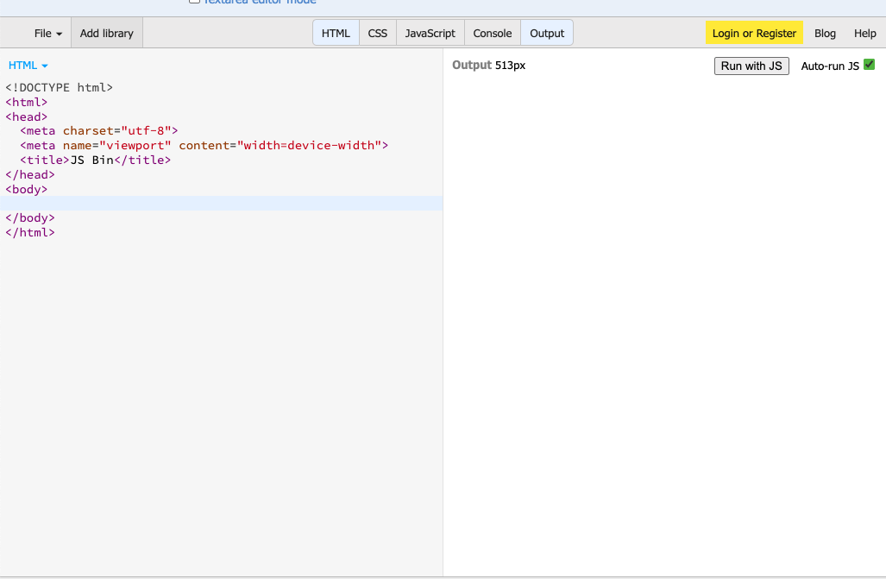
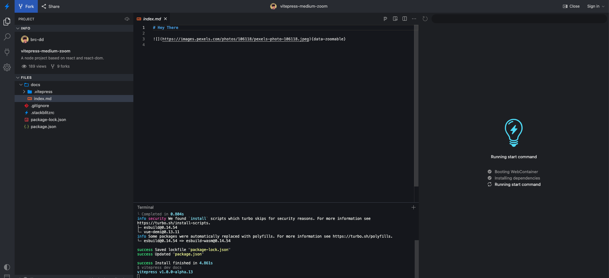
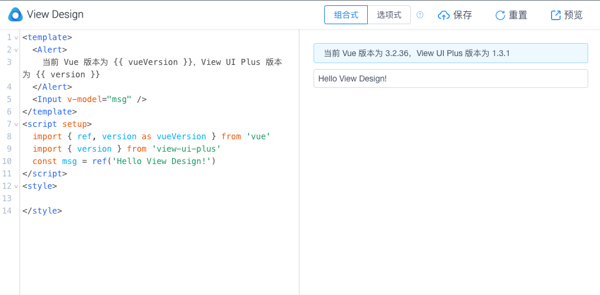
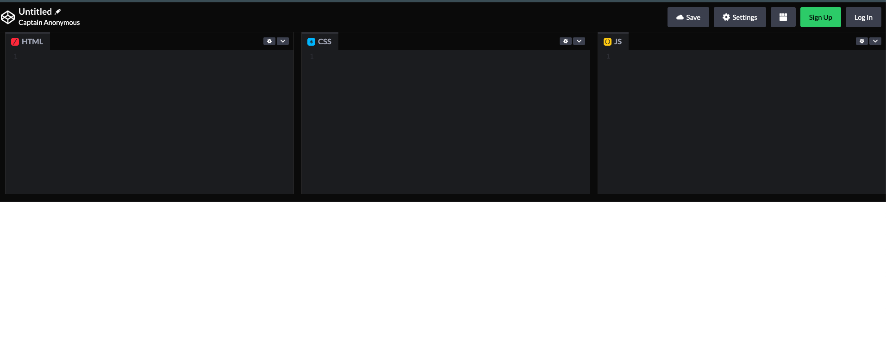
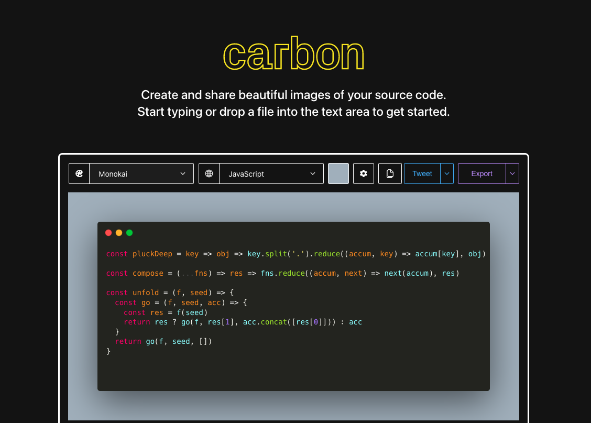
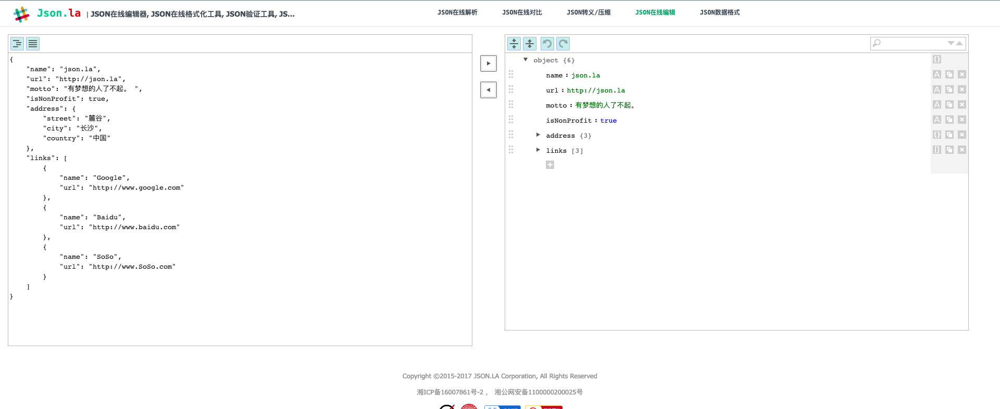

# 收藏网址

## 在线工具

### 查询

| 名称 | 地址 | 备注 | 
| -- | -- | -- |
| 苹果安全更新 | https://support.apple.com/zh-cn/HT201222 | -- |
| css兼容性查询-can i use | https://www.caniuse.com/ | -- |
| 编程语言简易语法学习 | https://devhints.io/ | -- |
| emoji表情代码 | https://gitmoji.carloscuesta.me/ | -- |
| 站点检测 | https://builtwith.com/ | -- |
| -- | -- | -- |
| -- | -- | -- |

### 编辑

| 名称 | 地址 | 备注 | 截图 |
| -- | -- | -- | -- |
| 在线代码编辑-jsbin | https://jsbin.com/?html,output |  | {data-zoomable} |
| 在线代码编辑-stackblitz | https://stackblitz.com/ |  | {data-zoomable} |
| 在线代码编辑-iview | https://run.iviewui.com/ | -- | {data-zoomable} |
| 在线开源code平台 | https://codepen.io/ | -- | {data-zoomable} |
| md5在线编辑并转发 | https://editor.mdnice.com/ | 支持微信，知乎，墨滴等平台 | -- |
| 在线代码美化截图平台 | https://carbon.now.sh | -- | {data-zoomable} |
| json在线编辑器 | https://json.la/online.html | -- | {data-zoomable} |
| 在线站位图片 | https://dummyimage.com/ | -- | -- |
| 图片压缩 | https://tinypng.com/ | 小熊猫高质量在线压缩 | -- |
| -- | -- | -- | -- |
| -- | -- | -- | -- |
| -- | -- | -- | -- |
## React系列

### 官方文档

| 名称 | 地址 | 备注 | 
| -- | -- | -- |
| 《React中文文档》 | https://zh-hans.reactjs.org | :fire: 官方文档 |
| 《Create React App 英文文档》 | https://create-react-app.dev | :fire: 脚手架搭建工具 |
| -- | -- | -- |

### 社区文章

| 名称 | 地址 | 备注 | 
| -- | -- | -- |
| 《打造开箱即用的 react 移动端框架》 | https://juejin.cn/post/7052204193968291870#heading-13 | -- |
| 《打造属于你的Ant Design Pro V5（一）》 | https://juejin.cn/post/7052882721592311822 | 作者-小杜杜，该系列有多篇值得借鉴 |
| -- | -- | -- |

## Vue系列

## 微信相关

